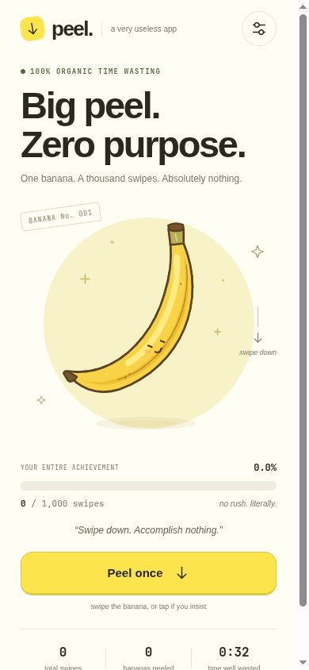
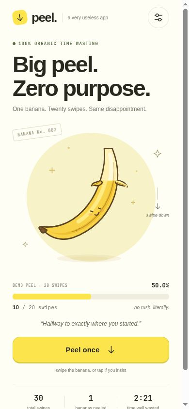
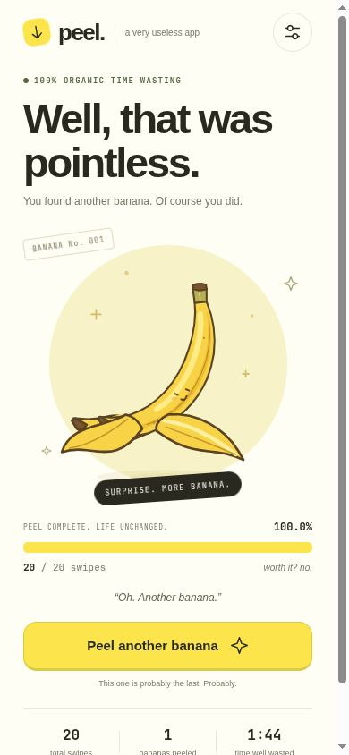
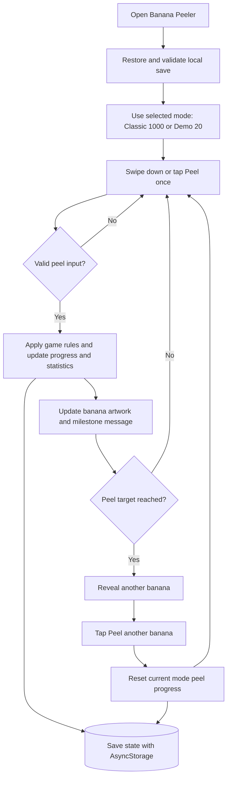

# Banana Peeler 🍌

## Basic Details

### Team Name: Qorvode

### Team Members

- **Team Lead (Head):** Sayyid Rafid
- **Member 2:** Aslam Mohammed

College affiliations were not provided.

### Project Description

Banana Peeler is a deliberately useless Expo app for Android and iPhone: swipe down 1,000 times to peel a virtual banana. Your reward is another banana. Repeat for no reason, or use the 20-swipe hackathon demo to reach the same disappointment sooner.

### The Problem (that doesn't exist)

Real bananas peel too quickly and occasionally provide nutrition. People deserve a banana that consumes their time without giving anything back.

### The Solution (that nobody asked for)

We stretched one simple action into 1,000 swipes, added a progress bar to make it feel important, and hid another banana inside. The app saves your progress so your wasted effort never goes to waste.

## Technical Details

### Technologies/Components Used

#### Software

| Category | Technologies |
| --- | --- |
| Language | TypeScript 6.0 |
| Frameworks | Expo SDK 57 (`~57.0.22`), React Native 0.86.3, React 19.2.3 |
| Artwork | React Native SVG 15.15.4; original vector banana illustration |
| Storage | AsyncStorage 2.2.0 for local progress and preferences |
| Device features | Expo Haptics, Expo Status Bar, React Native Safe Area Context |
| Web preview | React Native Web 0.21, React DOM 19.2.3 |
| Development tools | Node.js 22.18+, npm, Expo CLI, TypeScript compiler, Node.js test runner, Git, GitHub |

The app has no account system or backend. Progress stays on the device.

#### Hardware

Not applicable: no custom hardware, circuits, or assembly are required. Use a compatible phone, simulator/emulator, or web browser.

### Key Features

- **Endless peeling:** finish one banana, discover another, and start again.
- **Classic and demo modes:** 1,000 or 20 swipes per banana, with separate saved progress for each mode.
- **Progressive SVG artwork:** the peel opens as the count increases, with a small animated wobble after each peel.
- **Sarcastic milestones:** messages celebrate your increasingly unnecessary commitment.
- **Lifetime statistics:** total swipes, bananas peeled, and time spent with the app active. Statistics include both modes; the timer also runs while settings are open.
- **Local saves:** progress, statistics, and preferences survive reopening the app. Invalid saved data is validated, and a storage error appears if saving fails.
- **Optional haptics:** supported devices provide feedback for each peel and a completion vibration.
- **Accessible controls:** a “Peel once” button as an alternative to swiping, screen-reader labels and announcements, and reduced-motion support.
- **Directional gesture handling:** short movements, upward swipes, and sideways drags do not count as peels.

### Implementation

#### Installation

Use **Node.js 22.18 or newer**. The tests use Node.js's native TypeScript support.

```sh
git clone https://github.com/sayyidrafidalhadi/useless_project_temp.git
cd useless_project_temp
npm ci
```

#### Run on Android or iPhone

```sh
npm start
```

Open the development QR code with an **Expo Go build compatible with Expo SDK 57**. Check [Expo Go](https://expo.dev/go) for a compatible client, and keep the phone and development computer on the same Wi-Fi. If the network blocks local connections, try:

```sh
npx expo start --tunnel
```

Expo may offer to install its tunnel helper. To launch an installed Android emulator, use `npm run android`. To launch an iOS simulator, use `npm run ios` on macOS with an installed iOS simulator.

#### Run the Web Preview

```sh
npm run web
```

Open the local URL printed by Expo in your browser. This is a browser preview of the same app.

#### Check and Export

```sh
npm run typecheck
npm test
npm run export
```

- `typecheck` checks the TypeScript source without generating files.
- `test` runs the game-rule and saved-state validation tests.
- `export` bundles the app for Android, iOS, and web. It does not produce an APK or an App Store installation package; native release builds require a separate build and signing setup.

### Project Documentation

#### Screenshots

These are actual mobile-size browser previews of the app. The partial-peel and reveal screenshots use hackathon demo mode.



*Initial screen: one untouched banana, a thousand required swipes, and no useful destination.*



*Partial peel in demo mode: the peel opens, the counter rises, and milestone messages question your priorities.*



*Demo-mode reveal: another banana. Tap “Peel another banana” to achieve the same thing again.*

#### Workflow Diagram



*Each mode keeps its own peel progress. Lifetime statistics combine both modes, and state changes are saved locally. The timer counts foreground app time.*

#### Repository Layout

| File or directory | Purpose |
| --- | --- |
| `App.tsx` | Main screen, swipe interaction, settings, and animations |
| `src/components/Banana.tsx` | Original SVG artwork and progressive peel |
| `src/game.ts` | Game rules, mode switching, gesture validation, and save validation |
| `src/useGame.ts` | Local state, serialized saves, and foreground timer |
| `tests/game.test.mjs` | Game-rule and invalid-save tests |
| `assets/` | App icons and favicon |
| `docs/screenshots/` | Screenshots used in this README |
| `app.json` | Expo app configuration |

#### Hardware Documentation

Not applicable: this is a software-only project.

### Project Demo

#### Video

A demo video link was not provided.

#### Interactive Demo Walkthrough

1. Start the app using one of the run commands above.
2. Open **Settings** using the sliders button in the top-right corner.
3. Enable **Hackathon demo** and return to the banana. This mode takes 20 swipes, and your classic-mode progress is kept separately.
4. Swipe downward on the banana, or tap **Peel once**.
5. Watch the peel open and the progress messages change.
6. At 100%, discover the smaller banana inside.
7. Tap **Peel another banana** to repeat the experience for no reason.

The screenshots above show the browser preview. Physical-device testing has not been confirmed.

## Team Contributions

- **Sayyid Rafid:** Team Lead (Head).
- **Aslam Mohammed:** Team Member.

A detailed breakdown of individual contributions was not provided.

No goals. No growth. Just banana.

---
Made with ❤️ at TinkerHub Useless Projects


